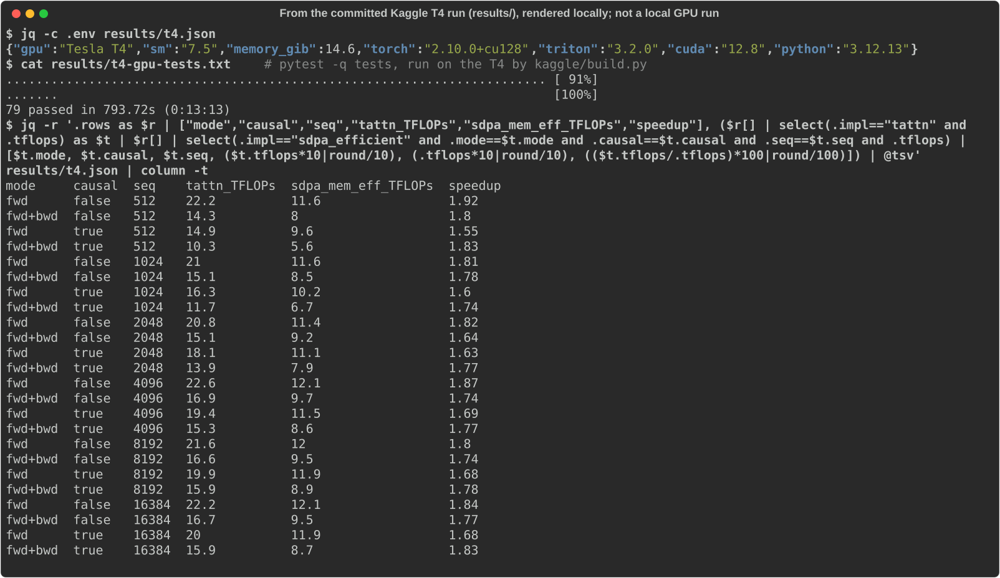

# triton-attn

> **Credits.** Built by Amaan Mithani with Claude (Anthropic) as the AI coding assistant.

FlashAttention-2 style attention in [Triton](https://github.com/triton-lang/triton), forward and backward, tuned
for the NVIDIA T4 (the free Kaggle GPU) and measured against PyTorch's own attention backends.

```python
from tattn import attention

out = attention(q, k, v, causal=True)  # q, k, v: [batch, heads, seq, dim], fp16 or fp32; autograd works
```

On a CUDA GPU the Triton kernels run; under `TRITON_INTERPRET=1` they run on the CPU (that's how CI tests them); on
anything else the same algorithm runs as a tiled PyTorch reference.

## See it running (on the Kaggle T4)



This is **from the committed Kaggle T4 run**, not a local run: Triton kernels need an NVIDIA GPU, and this was rendered on a Mac. The image shows the GPU environment recorded in `results/t4.json`, the pytest log the Kaggle job saved after running the full test suite on the T4 (`results/t4-gpu-tests.txt`, 79 passed), and every tattn vs SDPA mem-efficient row of `results/t4.json`, extracted with the `jq` command shown.

## What's inside

- **Forward** (`src/tattn/kernels.py`): one program per (query block, batch×head). It streams key/value blocks
  through shared memory with an online softmax: a running row max and sum in fp32, exponentials in base 2
  (`exp2`, scores pre-scaled by `log2(e)`), and a rescale of the accumulator when the max moves. Causal masking skips
  key blocks above the diagonal entirely. It saves one float per row, `M = max + log2(sum)`, for the backward.
- **Backward**, split the FlashAttention-2 way into two kernels so nothing needs atomics:
  - dK/dV: one program per key block, looping over query blocks.
  - dQ: one program per query block, looping over key blocks.
  - Both rebuild the probabilities from `M` instead of storing the N×N matrix. `D = rowsum(dO ∘ O)` is computed once
    up front by a small Triton kernel, without fp32 copies of O and dO.
- **Autotuning for sm75**: block sizes, warps and stages. Configurations that can't fit a T4's shared memory for the
  head size are pruned before tuning.
- **A tiled PyTorch reference** (`src/tattn/reference.py`) of the same algorithm. It's readable, and it makes the
  algorithm testable without Triton.

## Correctness

Tests compare the output and all three gradients with the textbook definition (materialised scores, float32
autograd) across:

- fp16 and fp32;
- causal and non-causal;
- head dims 16/32/64;
- sequence lengths that aren't multiples of the block size (1, 17, 33, 70);
- non-contiguous inputs.

CI runs them against the real Triton kernels under the Triton CPU interpreter. The Kaggle job runs them again on the
T4 before benchmarking, and keeps the log.

<!-- accuracy:start -->
Reference: float32 materialised attention up to 4,096; above that, float32 SDPA mem-efficient on the first two heads (an independent implementation; the materialised version doesn't fit).

| impl | worst max abs error (fwd, all lengths) | worst mean abs error |
|---|---|---|
| tattn (this repo) | 1.21e-03 | 2.60e-05 |
| SDPA mem-efficient | 1.21e-03 | 2.60e-05 |
| SDPA math | 9.76e-04 | 1.82e-05 |
| naive | 9.76e-04 | 1.82e-05 |

tattn gradients vs float32 autograd (seq 1,024 and 4,096, batch 1), max abs error: dq 1.9e-04 (seq 1024, full), dk 2.8e-04 (seq 1024, full), dv 2.1e-04 (seq 1024, full), dq 1.4e-03 (seq 1024, causal), dk 1.4e-03 (seq 1024, causal), dv 1.6e-03 (seq 1024, causal), dq 1.2e-04 (seq 4096, full), dk 1.3e-04 (seq 4096, full), dv 8.3e-05 (seq 4096, full), dq 1.2e-03 (seq 4096, causal), dk 1.3e-03 (seq 4096, causal), dv 1.5e-03 (seq 4096, causal).
<!-- accuracy:end -->

## Performance on a T4

<!-- perf:start -->
**Summary:** against PyTorch's fastest attention on this GPU (SDPA memory-efficient; the flash backend needs sm80), tattn is 1.55–1.92× faster forward and 1.64–1.83× faster forward+backward across all lengths, causal and not. Its forward+backward peak extra memory is 130 MiB against 226 MiB for SDPA mem-efficient. Its best forward rate, 22.6 TFLOP/s, is 35% of the T4's nominal 65 TFLOP/s fp16 tensor-core peak. In the same run cuBLAS reached 18.9 TFLOP/s on a 4096³ fp16 matmul, less than the attention kernel; in the version-sweep job it measured 21.0–27.6. The T4 is capped at 70 W and a long dense GEMM throttles hardest, so treat that comparison as noise, not as beating cuBLAS. Output error is checked at every benchmarked length, including 8k and 16k (below).

Tesla T4 (sm 7.5, 14.6 GiB), torch 2.10.0+cu128, Triton 3.2.0, CUDA 12.8. fp16, head dim 64, 16 heads, batch × seq = 16,384 tokens. Timer: triton.testing.do_bench(return_mode='median'), warmup 25 ms, rep 100 ms. FLOPs: 4*B*H*N^2*D (halved when causal); fwd+bwd = 3.5x fwd.

**Forward, non-causal: TFLOP/s**

| seq (batch) | tattn (this repo) | SDPA mem-efficient | SDPA flash | SDPA math | naive |
|---|---|---|---|---|---|
| 512 (32) | 22.2 | 11.6 | n/a | 1.2 | 1.5 |
| 1,024 (16) | 21.0 | 11.6 | n/a | 1.2 | 1.4 |
| 2,048 (8) | 20.8 | 11.4 | n/a | 1.0 | 1.4 |
| 4,096 (4) | 22.6 | 12.1 | n/a | 1.1 | 1.4 |
| 8,192 (2) | 21.6 | 12.0 | n/a | OOM | OOM |
| 16,384 (1) | 22.2 | 12.1 | n/a | OOM | OOM |

**Forward, causal: TFLOP/s**

| seq (batch) | tattn (this repo) | SDPA mem-efficient | SDPA flash | SDPA math | naive |
|---|---|---|---|---|---|
| 512 (32) | 14.9 | 9.6 | n/a | 0.5 | 0.6 |
| 1,024 (16) | 16.3 | 10.2 | n/a | 0.5 | 0.5 |
| 2,048 (8) | 18.1 | 11.1 | n/a | 0.5 | 0.6 |
| 4,096 (4) | 19.4 | 11.5 | n/a | 0.5 | 0.5 |
| 8,192 (2) | 19.9 | 11.9 | n/a | OOM | OOM |
| 16,384 (1) | 20.0 | 11.9 | n/a | OOM | OOM |

**Forward + backward, non-causal: TFLOP/s**

| seq (batch) | tattn (this repo) | SDPA mem-efficient | SDPA flash | SDPA math | naive |
|---|---|---|---|---|---|
| 512 (32) | 14.3 | 8.0 | n/a | 1.7 | 1.8 |
| 1,024 (16) | 15.1 | 8.5 | n/a | 1.6 | 1.7 |
| 2,048 (8) | 15.1 | 9.2 | n/a | 1.6 | 1.7 |
| 4,096 (4) | 16.9 | 9.7 | n/a | OOM | OOM |
| 8,192 (2) | 16.6 | 9.5 | n/a | OOM | OOM |
| 16,384 (1) | 16.7 | 9.5 | n/a | OOM | OOM |

**Forward + backward, causal: TFLOP/s**

| seq (batch) | tattn (this repo) | SDPA mem-efficient | SDPA flash | SDPA math | naive |
|---|---|---|---|---|---|
| 512 (32) | 10.3 | 5.6 | n/a | 0.9 | 0.8 |
| 1,024 (16) | 11.7 | 6.7 | n/a | 0.8 | 0.7 |
| 2,048 (8) | 13.9 | 7.9 | n/a | 0.8 | 0.8 |
| 4,096 (4) | 15.3 | 8.6 | n/a | OOM | OOM |
| 8,192 (2) | 15.9 | 8.9 | n/a | OOM | OOM |
| 16,384 (1) | 15.9 | 8.7 | n/a | OOM | OOM |

**Peak extra memory, forward + backward, non-causal (MiB)**

| seq (batch) | tattn (this repo) | SDPA mem-efficient | SDPA flash | SDPA math | naive |
|---|---|---|---|---|---|
| 512 (32) | 130 | 226 | n/a | 2,272 | 2,240 |
| 1,024 (16) | 130 | 226 | n/a | 4,320 | 4,288 |
| 2,048 (8) | 130 | 226 | n/a | 8,416 | 8,384 |
| 4,096 (4) | 130 | 226 | n/a | OOM | OOM |
| 8,192 (2) | 130 | 226 | n/a | OOM | OOM |
| 16,384 (1) | 130 | 226 | n/a | OOM | OOM |

- SDPA flash did not run on this GPU: `No available kernel. Aborting execution.`
<!-- perf:end -->

### Triton version matters on Turing

The first T4 run used Kaggle's default Triton (3.6.0). The kernels were correct but ran at a tenth of the speed.
The compiled PTX had no tensor-core instructions: every `tl.dot` had become fp32 FMAs. A bare fp16 matmul kernel
behaved the same way, so the problem is in the compiler, not these kernels. I swept every release from 2.3.1 to
3.6.0 on the same T4 (table below). The newest release tested that works on sm75 is 3.2.0, and every number above is
measured with it; the Kaggle job pins it. With Triton 3.3 or later on a Turing GPU, `attention()` raises a
`RuntimeWarning`.

<!-- versions:start -->
| Triton | bare fp16 matmul (128×128 tile) | this repo's forward kernel (128×64 tile) |
|---|---|---|
| 2.3.1 | 13.6 TFLOP/s, 64 `mma` | compile error |
| 3.0.0 | 15.3 TFLOP/s, 64 `mma` | 256 `mma`, 4 fp32 `fma` |
| 3.1.0 | 14.4 TFLOP/s, 64 `mma` | 256 `mma`, 4 fp32 `fma` |
| 3.2.0 | 14.6 TFLOP/s, 64 `mma` | 256 `mma`, 4 fp32 `fma` |
| 3.3.0 | compile error | compile error |
| 3.3.1 | compile error | compile error |
| 3.4.0 | 0.1 TFLOP/s, 0 `mma` | 0 `mma`, 8208 fp32 `fma` |
| 3.5.0 | 0.1 TFLOP/s, 0 `mma` | 0 `mma`, 8208 fp32 `fma` |
| 3.5.1 | 0.1 TFLOP/s, 0 `mma` | 0 `mma`, 8208 fp32 `fma` |
| 3.6.0 | 0.1 TFLOP/s, 0 `mma` | 0 `mma`, 8208 fp32 `fma` |

Compile errors, verbatim from `results/diagnose-log-triton-*.txt`: 3.3.0 and 3.3.1 abort with `Unsupported conversion from f16 to f16` / `Unsupported rounding mode for conversion` on sm75. 2.3.1 compiles the matmul but not the attention kernel, because it predates `tl.dot(input_precision=...)`, which this repo uses; that is an API difference, not a Turing issue.

The matmul kernel in the sweep is deliberately untuned (it exists to show whether tensor-core code is emitted), so its TFLOP/s are not a reference for what Triton can reach. One Kaggle job ran the whole sweep, reinstalling Triton between versions (`python kaggle/build.py diagnose`).
<!-- versions:end -->

<!-- regression:start -->
Same kernels, same GPU, Triton 3.6.0: forward at 16k tokens, non-causal, 1.3 TFLOP/s, against 22.2 with Triton 3.2.0 (`results/t4-triton-3.6.0.json`, from an earlier run timed with do_bench's default mean rather than the median).
<!-- regression:end -->

Reproduce: `python kaggle/build.py bench 3.2.0 && uvx kaggle kernels push -p kaggle/kernel` (or `python kaggle/build.py diagnose` for the version sweep) (Kaggle account with a phone-verified
GPU quota), then `uvx kaggle kernels output amaanmithani/triton-attn-bench -p results/` and
`uv run python bench/report.py`.

## Limits

- Forward and backward for dense attention only: no dropout, bias/ALiBi, GQA/MQA, variable-length batches or KV-cache
  decoding.
- On sm75, install `triton==3.2.0` yourself (`pip install triton==3.2.0`). The package only requires `triton>=3.1`,
  so it doesn't force an old Triton on newer GPUs. On sm75, 3.3.x fails to compile and 3.4+ runs about 10× slower.
  CI tests the kernels under the Triton CPU interpreter with the latest Triton; the GPU numbers use 3.2.0 with
  Kaggle's torch 2.10, which was built against a newer Triton (the kernels don't use torch's Triton integration).
- Head dims 16/32/64/128 (powers of two). Tuned and measured only on sm75. The autotuner will pick configurations on
  other GPUs, but nothing here is measured there.
- The autotuner tunes once per power-of-two sequence-length bucket. The first call in each bucket compiles and
  times every config.
- FLOP counts are the usual convention (4·B·H·N²·D forward, halved for causal, backward counted as 2.5× forward), so
  TFLOP/s figures are comparable across implementations but aren't hardware counters.

## Development

```sh
uv sync && uv run pytest              # reference path on macOS; on Linux set TRITON_INTERPRET=1 to test the kernels
uv run ruff check . && uv run mypy
```
